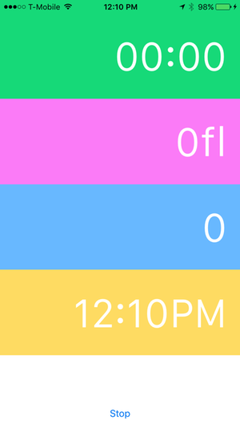
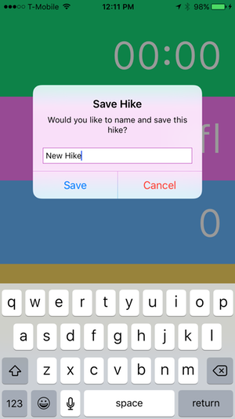
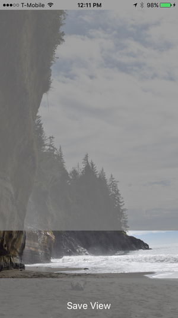
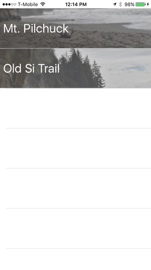

# Hiker

A small app to accompany you on your hikes! Save pedometer, altimeter, and date information about your hikes for later review. Also contains the ability to associate an image with the hike. There's still plenty to polish, fix, and complete about this app so it's not intended to be installed and used in production.

## Navigation

The following are likely files of interest to those browsing the source code:

* [HikeControlViewController.swift](https://github.com/syoutsey/Hiker/tree/master/Hiker/HikeControlViewController.swift)
* [HikeManager.swift](https://github.com/syoutsey/Hiker/tree/master/Hiker/HikeManager.swift)
* [SelectImageCropViewController.swift](https://github.com/syoutsey/Hiker/tree/master/Hiker/SelectImageCropViewController.swift)

## Screenshots

